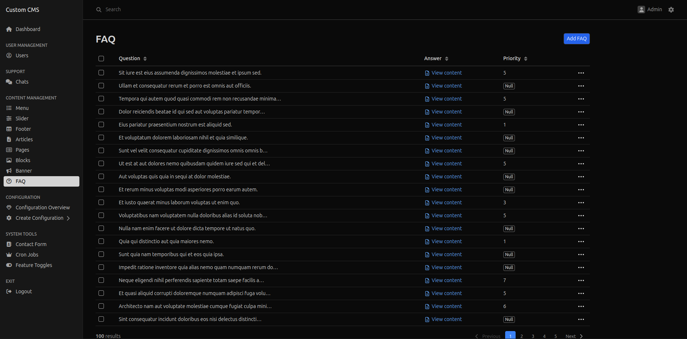

# Custom CMS


## 📌 Project Information
A custom CMS built on Symfony, designed for flexibility and ease of development. This project utilizes Docker for containerized development and supports GraphQL.

### 🔖 Version
**Current version:** 1.0.0

---

## 🚀 Installation Guide

Follow these steps to set up the project on your local machine:

```sh
# 1. Clone the repository
git clone <repository_url>
cd <project_directory>

# 2. Start Docker containers
docker-compose up -d --build

# 3. Access the application container
docker exec -ti container_name /bin/bash

# 4. Install dependencies
composer install

# 5. Open the application in a browser
# http://localhost/

# 6. Run database migrations
php bin/console doctrine:migrations:migrate

# 7. (Optional) Create the database manually
php bin/console doctrine:database:create

# 8. (Optional) Add a host entry (Linux/macOS)
echo '127.0.0.1 localhost' | sudo tee -a /etc/hosts
```

---

## 🐛 XDebug Setup

For detailed instructions on setting up XDebug with PHPStorm and Docker, refer to the dedicated guide: [XDEBUG_SETUP.md](XDEBUG_SETUP.md).

## 📢 Telegram Notifications

For detailed instructions on setting up Telegram notifications, refer to the dedicated guide: [TELEGRAM_NOTIFICATIONS.md](TELEGRAM_NOTIFICATIONS.md).

---

## 📌 Custom CLI Commands

### 🛠 Create Admin User
```sh
php bin/console app:create-admin <login> <password>
```
### 🛠 Creating empty index with mapping
```sh
php bin/console fos:elastica:create
```

---

## 🔬 GraphQL Testing | Documentation

To test GraphQL queries or check documentation, navigate to:
[http://localhost/graphiql](http://localhost/graphiql)

---
## 👀 Overview


📌 _Happy coding! 🚀_