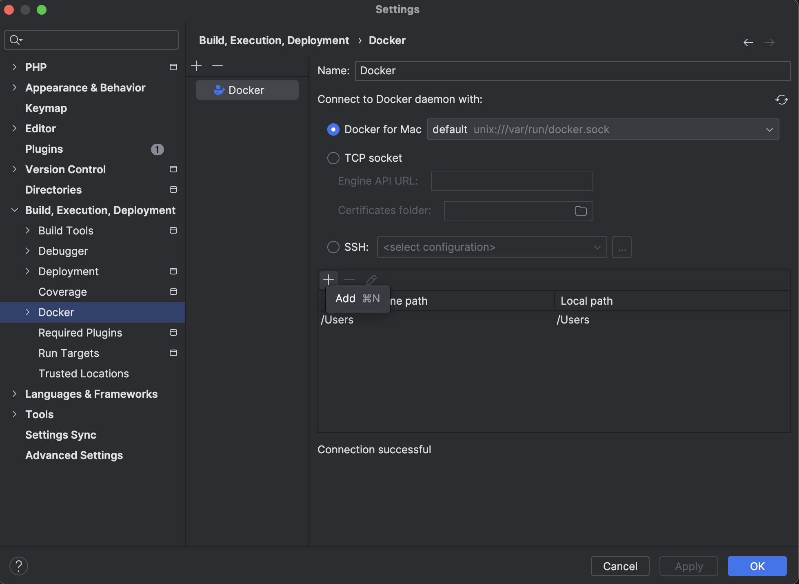
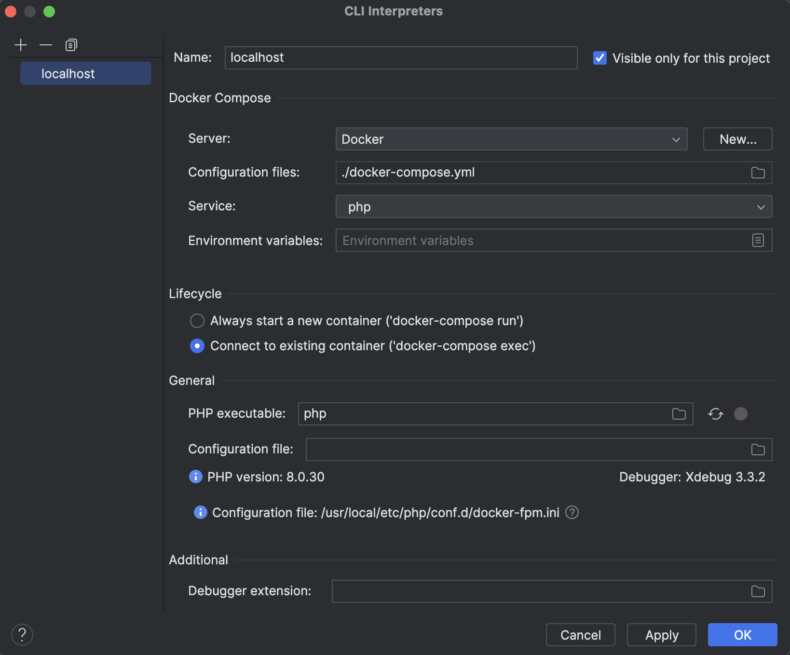
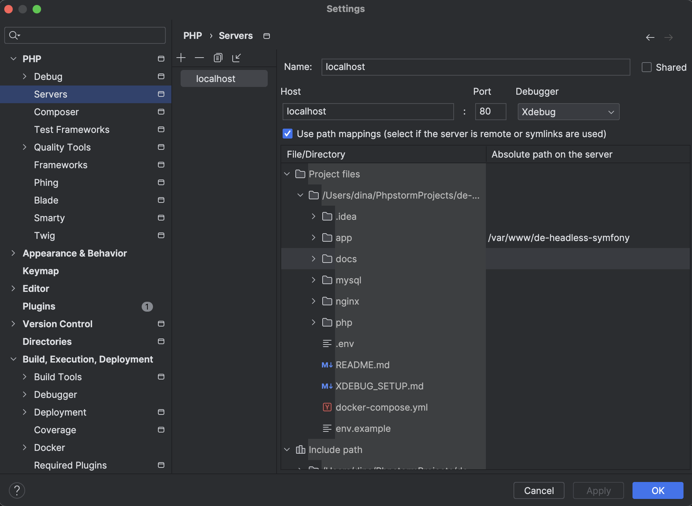
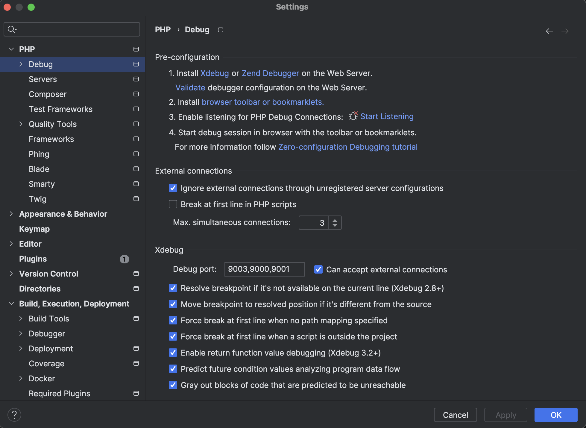
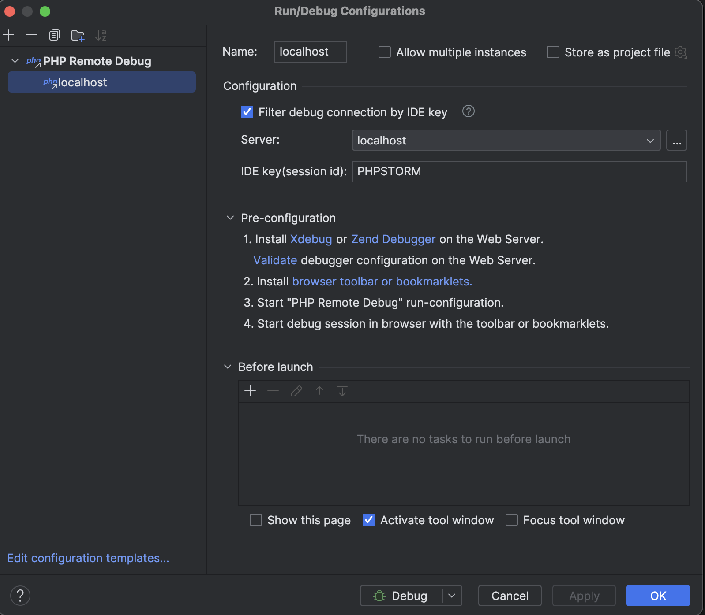

# XDebug Setup with PHPStorm and Docker

Follow these steps to configure XDebug for debugging in PHPStorm:

---

### 1. Configure PHPStorm Integration with Docker
- Go to **Settings > Build, Execution, Deployment > Docker**.
- Add a new Docker configuration using the local Docker application.

---

### 2. Configure Remote CLI Interpreter
- Go to **Settings > PHP > CLI Interpreter**.
- Click the **three dots** on the right and add a new interpreter.
- Select **Docker** and configure it to use the PHP container.

---

### 3. Configure Server Mapping
- Go to **Settings > PHP > Servers**.
- Add a new server configuration:
  - Name: `localhost`
  - Host: `localhost`
  - Port: `80`
  - Debugger: `XDebug`
  - Use path mappings: Map your project directory to the container's directory (e.g., `/var/www/html`).

---

### 4. Configure XDebug Port
- Go to **Settings > PHP > Debug > XDebug**.
- Set the **Debug port** to `9001`.

---

### 5. Configure Debug Configuration
- Go to **Run > Edit Configurations**.
- Add a new configuration based on **PHP Remote Debug**:
  - Name: `XDebug Docker`
  - Server: `localhost`
  - IDE key: `PHPSTORM`
- Apply and save the configuration.

---

